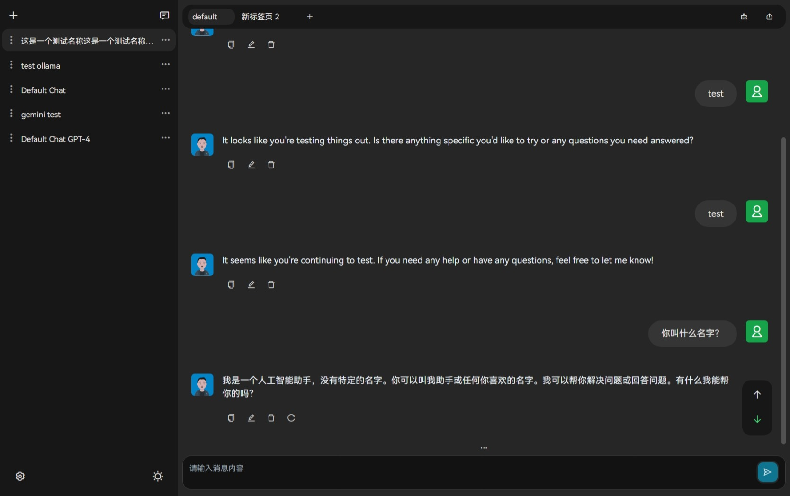

<h2 align="center">

<span>ChatGPTBox</span>
</h2>
<p align="center">
    <a href="./README.md">English</a> | 简体中文
</p>
<p align="center">
    <em>跨平台ChatGPT工具箱，支持 OpenAI GPT & DALL-E，Google Gemini，Ollama。</em>
</p>

<p align="center">
    =7-brightgreen?logo=microsoft">
    =20-orange?logo=ubuntu">
    =10-blue?logo=apple">
</p>

<p align="center">
    
</p>

## 特性

- 支持多平台，Windows、Linux 和 macOS
- 可单独自定义聊天配置，多聊天配置互不干扰
- 单聊天配置支持多标签页，可同时打开多个聊天窗口
- 全局快捷键支持，可自定义快捷键

## 规划

- [x] 多标签页
- [x] 快捷键设置
- [x] 深色模式切换
- [x] 多模型支持
- [x] DALL·E 图片生成
- [x] Google Gemini
- [x] Ollama 支持
- [x] 多语言支持

## 教程

### 下载

下载最新版本：[GitHub Release](https://github.com/xiaochen0517/chat-gpt-box/releases)

### 安装

#### Windows

运行安装 `msi` 或者 `exe` 文件即可。

#### Linux

由于 `tauri` 需要 `webkit2gtk` 支持，所以需要安装 `webkit2gtk`。

```shell
# 安装webkit2gtk环境
sudo apt install libwebkit2gtk-4.1-0

# 安装deb包
sudo dpkg -i chat-gpt-box_*.*.*_amd64.deb
```

#### macOS

直接运行 `dmg` 文件，将 `ChatGPTBox.app` 拖到 `Applications` 文件夹，
随后打开 `Finder`，右键 `ChatGPTBox.app`，选择 `打开`，即可打开应用。

### Cloudflare Workers 部署

由于中国大陆地区无法访问 `openai` 的 `api`，所以需要使用 `Cloudflare Workers` 进行中转。

1. 注册 `Cloudflare` 账号
2. 注册域名
3. 创建 `Cloudflare Workers`
4. 将域名绑定到 `Cloudflare Workers`
5. 添加以下代码到 `Cloudflare Workers`

```javascript
const TELEGRAPH_URL = 'https://api.openai.com';

addEventListener('fetch', event => {
  event.respondWith(handleRequest(event.request))
})

async function handleRequest(request) {
  const url = new URL(request.url);
  const headers_Origin = request.headers.get("Access-Control-Allow-Origin") || "*"
  url.host = TELEGRAPH_URL.replace(/^https?:\/\//, '');
  const modifiedRequest = new Request(url.toString(), {
    headers: request.headers,
    method: request.method,
    body: request.body,
    redirect: 'follow'
  });
  const response = await fetch(modifiedRequest);
  const modifiedResponse = new Response(response.body, response);
  // 添加允许跨域访问的响应头
  modifiedResponse.headers.set('Access-Control-Allow-Origin', headers_Origin);
  return modifiedResponse;
}
```

> 详细内容可自行搜索 `Cloudflare Workers` 部署教程。

### 进阶

- [使用文档](./doc/doc-cn.md)

## 联系我

- [邮箱](mailto:xiaochen0517@qq.com)

## 许可证

[Apache License v2.0](./LICENSE)
