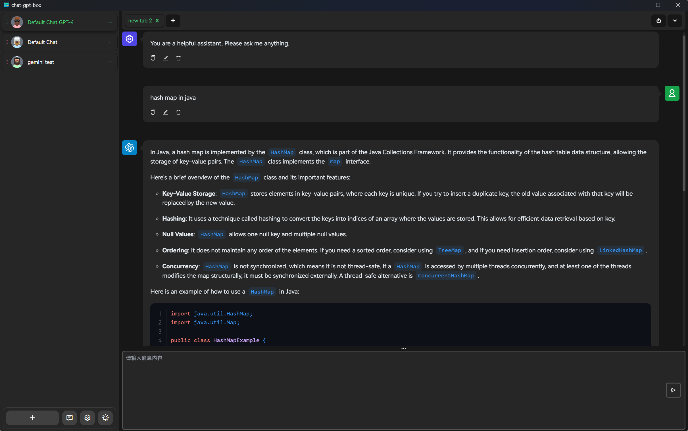

<h2 align="center">

<span>ChatGPTBox</span>
</h2>
<p align="center">
    English | <a href="./README-CN.md">简体中文</a>
</p>

<p align="center">
    <em>Cross-platform ChatGPTBox, supporting GPT & DALL-E API.</em>
</p>

<p align="center">
    =10-brightgreen?logo=microsoft">
    =20-orange?logo=ubuntu">
    =10-blue?logo=apple">
    =5.1-green?logo=android">
</p>

<p align="center">
    
</p>

## Features

- Supports multiple platforms, including Windows, Linux, macOS and Android
- Allows for individual customization of chat settings, with multiple chat configurations that do not interfere with
  each other
- Single chat configurations support multiple tabs, enabling multiple chat windows to be opened at the same time
- Global shortcut key support, with customizable shortcuts

## Roadmap

- [x] Multi-tab
- [x] Shortcut key configuration
- [x] Dark mode toggle
- [x] Multi-model support
- [x] DALL·E image generation
- [x] Google Gemini
- [x] Multi-language support
- [ ] Mobile support
    - [x] Mobile web
        - [x] Android
        - [ ] iOS
- [ ] TTS (Text-to-Speech) synthesis
- [ ] Whisper speech recognition

## Tutorial

### Download/Build

Download Release: [GitHub Release](https://github.com/xiaochen0517/chat-gpt-box/releases)

You can download the pre-packaged executable file, or build it by yourself.

```shell
# Install dependencies
yarn install

# Build Web version
yarn build

# Build Tauri desktop version
yarn build-tauri
```

**Android**

```shell
# Package and sync to the Android directory
yarn cap-sync

# Use Android Studio to open the android directory and pack it manually
```

### Install

#### Windows

Install by running the `msi` or `exe` file.

#### Linux

Since `tauri` requires `webkit2gtk` support, it is necessary to install `webkit2gtk`.

```shell
# Install webkit2gtk
sudo apt install libwebkit2gtk-4.1-0

# Install deb package
sudo dpkg -i chat-gpt-box_*.*.*_amd64.deb
```

#### macOS

Directly run the `dmg` file, drag `ChatGPTBox.app` into the `Applications` folder,
then open Finder, right-click on `ChatGPTBox.app`, select `open`, and the application will launch.

## Contact Me

- [Email](mailto:xiaochen0517@qq.com)

## License

[Apache License v2.0](./LICENSE)